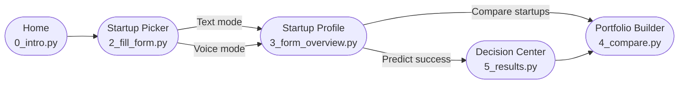
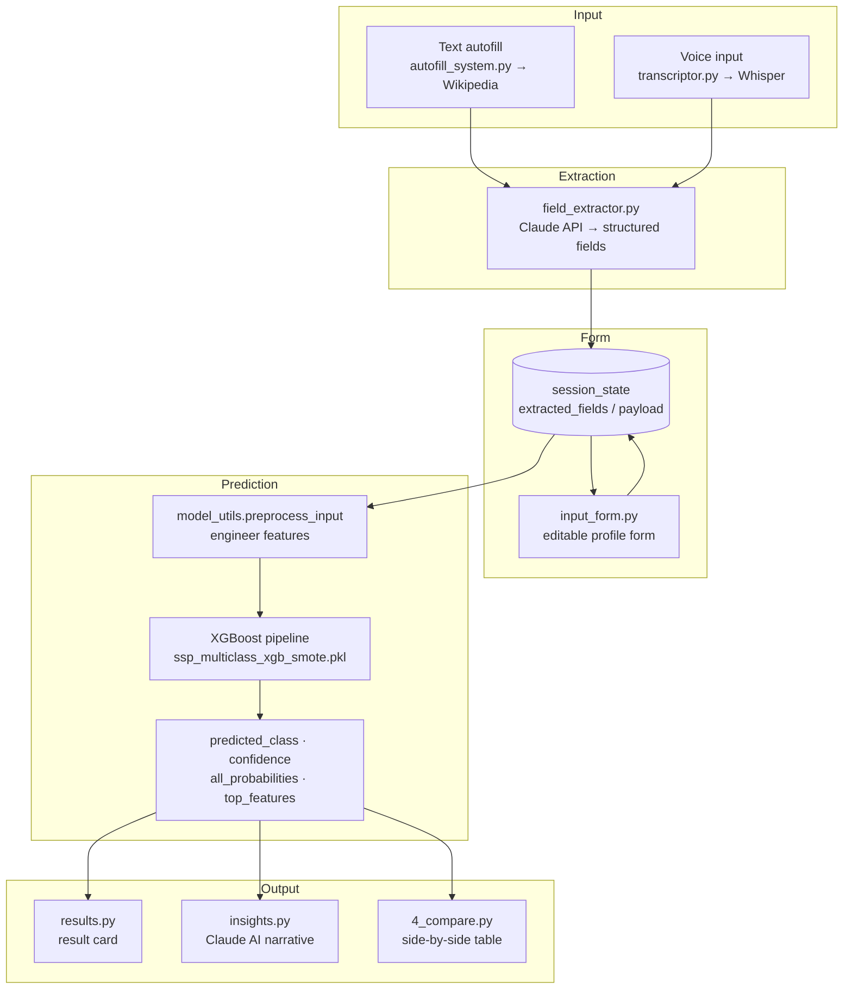

# Project Structure

## Directory Tree

```mermaid
graph TD
    ROOT["ssp/"]

    ROOT --> APP["app.py\nStreamlit entrypoint"]
    ROOT --> PAGES["pages/"]
    ROOT --> SRC["src/"]
    ROOT --> UTILS["utils/"]
    ROOT --> TESTS["tests/"]
    ROOT --> PROJECT["project/"]
    ROOT --> ASSETS["assets/"]
    ROOT --> MODELS["models/"]
    ROOT --> DOCS["docs/"]

    PAGES --> P0["0_intro.py\nHome / landing"]
    PAGES --> P2["2_fill_form.py\nStartup Picker"]
    PAGES --> P3["3_form_overview.py\nStartup Profile"]
    PAGES --> P5["5_results.py\nDecision Center"]
    PAGES --> P4["4_compare.py\nPortfolio Builder"]

    SRC --> COMP["components/"]
    SRC --> CHARTS["charts/"]
    SRC --> SERVICES["services/"]
    SRC --> CFG["config.py"]

    COMP --> NAV["navigation.py\nnavbar · CSS tokens · layout"]
    COMP --> FORM["input_form.py\ncompany profile form"]
    COMP --> AUTO["autofill.py\nWikipedia lookup → form fill"]
    COMP --> VOICE["voice_input.py\naudio → transcript → fields"]
    COMP --> RESULTS["results.py / results_v2.py\nresult card rendering"]
    COMP --> INSIGHTS["insights.py\nAI insights panel"]
    COMP --> HEADER["header.py"]
    COMP --> UI["ui.py"]

    CHARTS --> BCG["bcg_matrix.py"]
    CHARTS --> FEAT["feature_chart.py"]
    CHARTS --> GAUGE["gauge_chart.py"]
    CHARTS --> OUTCOME["outcome_chart.py"]

    SERVICES --> PRED["predictor.py\nrun model · return proba + features"]
    SERVICES --> TRANS["transcriptor.py\nWhisper / audio → text"]
    SERVICES --> FEXT["field_extractor.py\nClaude API → structured fields"]

    UTILS --> MU["model_utils.py\nload model · preprocess_input"]
    UTILS --> AS["autofill_system.py\nWikidata / Wikipedia scraper"]
    UTILS --> CAT["categorical_lists.py\nindustries · countries · states"]
    UTILS --> DP["data_prep.py"]
    UTILS --> VIZ["visualization.py"]

    PROJECT --> API["api/fast.py\nFastAPI wrapper"]
    PROJECT --> PARAMS["params.py"]

    MODELS --> PKL["ssp_multiclass_xgb_smote.pkl\nXGBoost pipeline"]
```

---

## User Flow

---

## Data Flow

---

## Key Files at a Glance

| File | Role |
|---|---|
| `app.py` | Streamlit `st.navigation` entrypoint; registers all pages |
| `src/components/navigation.py` | `render_page_navbar()`, `GLOBAL_CSS`, color tokens, `FLOW`, `PATH_BY_LABEL` |
| `src/components/input_form.py` | Company profile form widget |
| `src/services/predictor.py` | `get_prediction()` — wraps model, returns structured result dict |
| `utils/model_utils.py` | `load_ml_model()`, `preprocess_input()` — feature engineering |
| `utils/autofill_system.py` | Wikipedia / Wikidata scraper used by autofill |
| `src/services/field_extractor.py` | Claude API call that maps free text → form fields |
| `src/services/transcriptor.py` | Audio → text (Whisper) |
| `models/ssp_multiclass_xgb_smote.pkl` | Trained XGBoost pipeline (joblib) |
